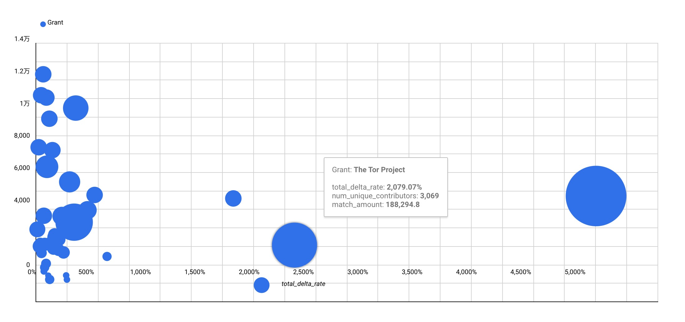

# Gitcoin Round 12 Grants Analytics
- [Report](reports/Gitcoin_Round_12_Report.pdf)
- [DataStudio Full Report](https://datastudio.google.com/reporting/c310c50d-37b2-40e8-b210-b9efb836e101)

## What's New - New Grants In Round 12
| Gran                                                                                         | category        | url                                                                              | match_amount     | crowdfund_amount_contributions_usd | total            | Unique contributors | match ratio         | 
|----------------------------------------------------------------------------------------------|-----------------|----------------------------------------------------------------------------------|------------------|------------------------------------|------------------|---------------------|---------------------| 
| Electronic Frontier Foundation                                                               | Community       | https://gitcoin.co/grants/3974/electronic-frontier-foundation                    | 228273.838777386 | 58715.0431696883                   | 286988.881947075 | 3331                | 3.8878254439440245  | 
| ZigZag Exchange                                                                              | Grants Round 12 | https://gitcoin.co/grants/4352/zigzag-exchange                                   | 75113.9697175857 | 166070.234615808                   | 241184.204333394 | 10573               | 0.4523024242806465  | 
| Longevity Prize (by VitaDAO)                                                                 | Grants Round 12 | https://gitcoin.co/grants/4083/longevity-prize-by-vitadao                        | 176195.452103108 | 7815.29498123227                   | 184010.74708434  | 857                 | 22.544952241243045  | 
| The Blockchain Association (BA)                                                              | Grants Round 12 | https://gitcoin.co/grants/4118/the-blockchain-association-ba                     | 95412.8424469888 | 59139.1783274689                   | 154552.020774457 | 2295                | 1.613360975674421   | 
| Kick-starting the market for future carbon                                                   | Grants Round 12 | https://gitcoin.co/grants/4119/kick-starting-the-market-for-future-carbon        | 81901.9983640592 | 33099.1735583776                   | 115001.171922436 | 1252                | 2.4744423971676266  | 
| L2BEAT                                                                                       | Community       | https://gitcoin.co/grants/3857/l2beat                                            | 72338.3668778467 | 40098.8610757044                   | 112437.227953551 | 7106                | 1.8040005361068963  | 
| Climate Finance DAO                                                                          | Community       | https://gitcoin.co/grants/4041/climate-finance-dao                               | 74435.6129371705 | 9236.54636486029                   | 83672.1593020308 | 1551                | 8.058814409285585   | 
| Rainforest Direct                                                                            | Community       | https://gitcoin.co/grants/3975/rainforest-direct                                 | 23185.5940456624 | 52871.3994899172                   | 76056.9935355796 | 899                 | 0.43852809400447196 | 
| "Lifespan.io Meets Web3 - Crowdsourced Clinical Trials, Inverse Quadratic Funding, and You!" | Community       | https://gitcoin.co/grants/3998/lifespanio-meets-web3-crowdsourced-clinical-trial | 66411.390316072  | 5816.53171501446                   | 72227.9220310864 | 537                 | 11.417695900228903  | 
| RainbowDAO Protocol                                                                          | dGov            | https://gitcoin.co/grants/4019/rainbowdao-protocol                               | 25000            | 46747.3521452402                   | 71747.3521452402 | 4811                | 0.5347896480281289  | 
| Just-DNA-Seq                                                                                 | Community       | https://gitcoin.co/grants/4048/just-dna-seq                                      | 58412.7362965053 | 10882.1925969781                   | 69294.9288934835 | 503                 | 5.367735938870083   | 

## Top Growing Faster Grants - By Total Amount

| Grant                                                                        | category   | url                                                                              | match_amount     | Total            | Total(Last round) | Change(Last Round) | match ratio         | 
|------------------------------------------------------------------------------|------------|----------------------------------------------------------------------------------|------------------|------------------|-------------------|--------------------|---------------------| 
| Coin Center is educating policy makers about public blockchains              | Community  | https://gitcoin.co/grants/1668/coin-center-is-educating-policy-makers-about-publ | 340000           | 443838.934783506 | 9642.003276       | 45.031817463521264 | 3.2743016933760605  | 
| The Tor Project                                                              | Infra Tech | https://gitcoin.co/grants/2805/the-tor-project                                   | 188294.797995953 | 283574.441189565 | 13013.57109       | 20.790670618264937 | 1.9762332402245688  | 
| Bloom Network - Panvala League                                               | Community  | https://gitcoin.co/grants/1595/bloom-network-panvala-league                      | 22916.7168915115 | 76734.3722095287 | 4007.604511       | 18.14719179472665  | 0.4258215404608946  | 
| EtherDrops                                                                   | dApp Tech  | https://gitcoin.co/grants/1661/etherdrops                                        | 25000            | 88692.3230298158 | 5256.498784       | 15.872889479168535 | 0.39251198277533356 | 
| Toucan Protocol —  Carbon as a money lego                                    | dApp Tech  | https://gitcoin.co/grants/3059/toucan-protocol-carbon-as-a-money-lego            | 7785.92489180964 | 40062.891994145  | 5961.36379        | 5.720423950866618  | 0.24122232014935238 | 
| Atlantis World                                                               | dApp Tech  | https://gitcoin.co/grants/3062/atlantis-world                                    | 25000            | 78760.5848976289 | 13765.14961       | 4.721738384914575  | 0.4650247025326285  | 
| zkCREAM: zero-knowledge Confidential Reliable Ethereum Anonymous Mixer       | Infra Tech | https://gitcoin.co/grants/337/zkcream-zero-knowledge-confidential-reliable-ethe  | 31001.434909992  | 50776.6770089123 | 9856.430136       | 4.151629576661192  | 1.567689273027145   | 
| ZeroPool - Scaling anonymous transactions for blockchains                    | dApp Tech  | https://gitcoin.co/grants/172/zeropool-scaling-anonymous-transactions-for-block  | 59963.6966922511 | 111917.981951516 | 26618.24981       | 3.204558254219645  | 1.1541626719146776  | 
| Rotki - The portfolio tracker and accounting tool that protects your privacy | dApp Tech  | https://gitcoin.co/grants/149/rotki-the-portfolio-tracker-and-accounting-tool-t  | 129131.340048487 | 154504.959651097 | 37891.80648       | 3.0775295242956435 | 5.089196656641144   | 
| Hardhat by Nomic Labs                                                        | dApp Tech  | https://gitcoin.co/grants/1592/hardhat-by-nomic-labs                             | 41403.6556766115 | 71109.6632849969 | 19155.27476       | 2.7122758183290556 | 1.3937805518141757  | 
| CryptoFees.info                                                              | Community  | https://gitcoin.co/grants/1624/cryptofeesinfo                                    | 3896.54206063941 | 11691.3410750152 | 3344.423918       | 2.4957712783033625 | 0.49988999760648817 | 

## Growing Faster Grants - By Contributors
| Grant                                                                  | category   | url                                                                              | Contributors | Contributors(last) | Change             | match ratio         | 
|------------------------------------------------------------------------|------------|----------------------------------------------------------------------------------|--------------|--------------------|--------------------|---------------------| 
| Atlantis World                                                         | dApp Tech  | https://gitcoin.co/grants/3062/atlantis-world                                    | 5784         | 685                | 7.443795620437956  | 0.4650247025326285  | 
| Hardhat by Nomic Labs                                                  | dApp Tech  | https://gitcoin.co/grants/1592/hardhat-by-nomic-labs                             | 6492         | 900                | 6.213333333333333  | 1.3937805518141757  | 
| Coin Center is educating policy makers about public blockchains        | Community  | https://gitcoin.co/grants/1668/coin-center-is-educating-policy-makers-about-publ | 5727         | 1158               | 3.9455958549222796 | 3.2743016933760605  | 
| EtherDrops                                                             | dApp Tech  | https://gitcoin.co/grants/1661/etherdrops                                        | 5596         | 1264               | 3.4272151898734178 | 0.39251198277533356 | 
| Optional                                                               | dApp Tech  | https://gitcoin.co/grants/3358/optional                                          | 2375         | 651                | 2.6482334869431643 | 0.7872618163649422  | 
| ZeroPool - Scaling anonymous transactions for blockchains              | dApp Tech  | https://gitcoin.co/grants/172/zeropool-scaling-anonymous-transactions-for-block  | 10488        | 4179               | 1.5096913137114143 | 1.1541626719146776  | 
| The CatalanDAO - Building the first digital nation DAO!                | dGov       | https://gitcoin.co/grants/3386/the-catalandao-building-the-first-digital-nation- | 3636         | 1456               | 1.4972527472527473 | 1.205398169265642   | 
| 🏗  scaffold-eth                                                       | Infra Tech | https://gitcoin.co/grants/2851/scaffold-eth                                      | 1430         | 632                | 1.2626582278481013 | 0.3979201237510129  | 
| BanklessDAO                                                            | Community  | https://gitcoin.co/grants/2916/banklessdao                                       | 3374         | 1512               | 1.2314814814814814 | 1.277501568945719   | 
| zkCREAM: zero-knowledge Confidential Reliable Ethereum Anonymous Mixer | Infra Tech | https://gitcoin.co/grants/337/zkcream-zero-knowledge-confidential-reliable-ethe  | 4960         | 2272               | 1.1830985915492958 | 1.567689273027145   | 
| Umbra:  Privacy Preserving Stealth Payments                            | Infra Tech | https://gitcoin.co/grants/821/umbra-privacy-preserving-stealth-payments          | 9912         | 4774               | 1.0762463343108504 | 0.4517360955678616  | 

## By Match Ratio

| Grant                                                                                        | category        | url                                                                              | Match            | Corwdfund        | Total            | match ratio        | 
|----------------------------------------------------------------------------------------------|-----------------|----------------------------------------------------------------------------------|------------------|------------------|------------------|--------------------| 
| Longevity Prize (by VitaDAO)                                                                 | Grants Round 12 | https://gitcoin.co/grants/4083/longevity-prize-by-vitadao                        | 176195.452103108 | 7815.29498123227 | 184010.74708434  | 22.544952241243045 | 
| "Lifespan.io Meets Web3 - Crowdsourced Clinical Trials, Inverse Quadratic Funding, and You!" | Community       | https://gitcoin.co/grants/3998/lifespanio-meets-web3-crowdsourced-clinical-trial | 66411.390316072  | 5816.53171501446 | 72227.9220310864 | 11.417695900228903 | 
| Incentivizing Actions That Increase and Maintain Native Ecosystems Through Tokenization      | Community       | https://gitcoin.co/grants/4006/incentivizing-actions-that-increase-and-maintain- | 25425.696131801  | 2670.844740595   | 28096.540872396  | 9.51972076300353   | 
| OpenCures                                                                                    | Community       | https://gitcoin.co/grants/3947/opencures                                         | 23277.4787951611 | 2509.77625421542 | 25787.2550493766 | 9.274722699310047  | 
| Impetus Longevity Grants                                                                     | Grants Round 12 | https://gitcoin.co/grants/4078/impetus-longevity-grants                          | 50806.3686851084 | 5539.78529786329 | 56346.1539829717 | 9.171180100554539  | 
| Climate Finance DAO                                                                          | Community       | https://gitcoin.co/grants/4041/climate-finance-dao                               | 74435.6129371705 | 9236.54636486029 | 83672.1593020308 | 8.058814409285585  | 
| Stopping Alzheimer's with Light and Sound                                                    | Community       | https://gitcoin.co/grants/3853/stopping-alzheimers-with-light-and-sound          | 12801.1481040106 | 2098.88980704727 | 14900.0379110579 | 6.099009133795035  | 
| The Alliance for Longevity Initiatives                                                       | Community       | https://gitcoin.co/grants/3945/the-alliance-for-longevity-initiatives            | 12643.8654302719 | 2169.83642440681 | 14813.7018546787 | 5.827105346767548  | 
| Ethereum Core Developer Apprenticeship Program                                               | Infra Tech      | https://gitcoin.co/grants/3468/ethereum-core-developer-apprenticeship-program    | 9408.18332556276 | 1674.03289647358 | 11082.2162220363 | 5.620070755707066  | 
| Just-DNA-Seq                                                                                 | Community       | https://gitcoin.co/grants/4048/just-dna-seq                                      | 58412.7362965053 | 10882.1925969781 | 69294.9288934835 | 5.367735938870083  | 
| Rotki - The portfolio tracker and accounting tool that protects your privacy                 | dApp Tech       | https://gitcoin.co/grants/149/rotki-the-portfolio-tracker-and-accounting-tool-t  | 129131.340048487 | 25373.61960261   | 154504.959651097 | 5.089196656641144  | 
